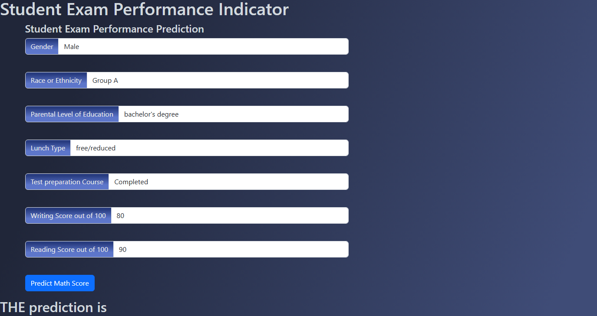

# Student Score Prediction Project

## About
This repository contains a project aimed at predicting students' average scores based on various demographic, socioeconomic, and performance-related features. The project includes exploratory data analysis (EDA), preprocessing, model training and evaluation, and a Flask-based web application for making predictions.

## Features
1. Exploratory Data Analysis (EDA):
    * Analyzed trends using histograms and KDE plots.
    * Key insight: Female students tend to perform better than male students.

2. Data Preprocessing:
    * Checked for missing and duplicate values (none found).
    * Created new features:
        * total_score: Sum of scores in math, reading, and writing.
        * average_score: Average of the three subject scores.
    * Applied:
        * One-hot encoding for categorical features.
        * Standard scaling for numerical features using ColumnTransformer.

3. Model Training:
    * Used multiple regression models, including: 
        * Linear Regression, Lasso, Ridge, KNN, Decision Tree, Random Forest, XGBoost, CatBoost, and AdaBoost.
    * Evaluated models using metrics such as RMSE, MAE, and R².
    * Saved the best-performing model for deployment.

4. Web Application:
    * Built using Flask, providing an interactive interface for users to input data and predict student scores.

5. Modular Development:
    * The project is structured in a modular manner to ensure scalability and maintainability:
        * src/pipeline: Contains utility scripts for exception handling, logging, and general functions.
        * src/components: Houses components for Data Ingestion, Data Transformation, and Model Training.
